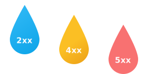
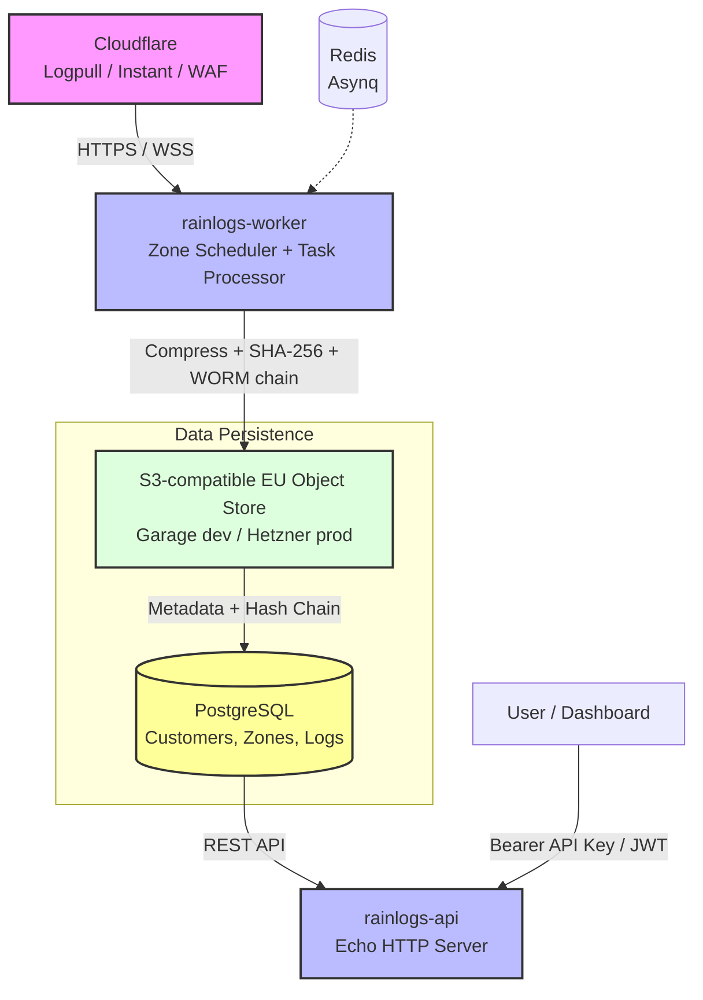

<div align="center">
  <a href="https://fabriziosalmi.github.io/rainlogs/">
    
  </a>
  <h1>RainLogs</h1>
  <p>
    <b>Cloudflare log archiving for NIS2-compliant European businesses.</b>
  </p>
</div>

RainLogs provides automated log collection, cryptographic verification, and long-term retention for Cloudflare zones. It is designed for EU-sovereign environments, storing data in S3-compatible object storage (Garage, Hetzner, Contabo) with WORM (Write Once, Read Many) integrity guarantees to meet NIS2 and GDPR requirements.

## Core Capabilities

### Compliance & Security
- **Data Integrity**: SHA-256 hash chaining ensures logs are tamper-evident. A CLI tool `rainlogs-verify` allows for independent auditing of the cryptographic chain.
- **Data Sovereignty**: Fully compatible with EU-based S3-compliant storage providers, ensuring no data exits the legal jurisdiction.
- **Retention Management**: Automated policies strictly enforce data retention periods (e.g., 395 days) to comply with GDPR storage limitation principles.
- **Access Control**: Role-Based Access Control (RBAC) separates administrative privileges from read-only access.

### Infrastructure & Reliability
- **Adaptive Collection**: Automatically selects the optimal retrieval method based on the Cloudflare plan level (Logpull, Instant Logs, or GraphQL).
- **Scalable Export**: Replaces Logpush for bulk export of large datasets to private S3 buckets.
- **Resilience**: Implements circuit breakers, exponential backoff, and automatic retries for robust operation against API failures.
- **High Availability**: Supports primary and secondary S3 storage providers with automatic failover.
- **Resource Management**: Configurable quotas per tenant to ensure fair resource allocation.
- **Observability**: Prometheus metrics and structured logging for system health monitoring.

## Integration

RainLogs aligns collection strategies with available Cloudflare plan features:

| Plan | Method | Data Type | Retention |
|---|---|---|---|
| **Enterprise** | Logpull API | Full Access Logs | Historical backfill (7 days) + Real-time |
| **Business** | Instant Logs | Full Access Logs | Real-time stream (WebSocket) |
| **Pro / Free** | Security Events | Security Events (WAF) | Blocked requests only |

[](https://github.com/fabriziosalmi/rainlogs/actions/workflows/ci.yml)
[](https://go.dev)
[](https://github.com/fabriziosalmi/rainlogs/releases)
[](LICENSE)

## Rationale

| Challenge | RainLogs Implementation |
|-----------|-------------------------|
| **Limited Retention**: Cloudflare retains Logpull data for 7 days. | Archives logs for configurable periods (e.g., 13+ months) to meet legal mandates. |
| **Plan Restrictions**: Real-time export (Logpush) is Enterprise-only. | Unifies Logpull, Instant Logs, and WAF polling into a single archive workflow for all plans. |
| **Data Integrity**: Raw logs lack forensic verifiability. | Implements a continuous SHA-256 hash chain to detect unauthorized modification. |
| **Data Residency**: US-based storage poses compliance risks. | Enforces storage strictly on user-defined EU providers. |
| **Incident Reporting**: Compliance requires rapid data access. | Generates structured NDJSON archives indexable by time window. |

---

## Architecture



### Key Components

| Component | Tech | Notes |
|-----------|------|-------|
| API server | Go 1.24 + Echo v4 | REST, API-key + JWT auth, per-customer rate limiting, security headers, Prometheus metrics |
| Worker | Go 1.24 + asynq | Pulls CF logs, stores WORM objects, verifies integrity |
| Queue | Redis 7 (asynq) | Reliable at-least-once delivery, retry with exponential backoff |
| Database | PostgreSQL 16 | Customers, zones, log jobs, WORM chain hashes |
| Object store | Garage / S3-compatible | EU-sovereign, partitioned by zone/date/hour, multi-provider failover |
| Integrity | SHA-256 + WORM hash chain | NIS2/forensic-grade tamper evidence |

### Engineering Standards

- **Idempotency**: Deterministic S3 keys prevent duplicate artifacts on job retries.
- **CQRS**: API and Worker services scale independently — reads vs writes.
- **Exponential Backoff with Jitter**: `asynq` handles transient Cloudflare failures automatically.
- **Hexagonal Architecture**: Core logic decoupled from DB, storage, and queue; easy to unit test.
- **Graceful Degradation**: Multi-provider S3 failover — if primary is unreachable, secondary providers are tried in order.
- **Dependency Injection**: All components wired explicitly at startup; no global state.
- **WORM Chain**: `ChainHash = SHA256(prevHash ∥ objectSHA256 ∥ jobID)` — tamper-evident, forensic-grade.
- **Graceful Shutdown**: SIGTERM drains connections cleanly, preventing data loss during rolling updates.

---

## Deployment

### Docker Compose

Deploys the complete stack including HTTPS termination, PostgreSQL, Redis, and S3 storage.

```bash
curl -fsSL https://raw.githubusercontent.com/fabriziosalmi/rainlogs/main/install.sh | bash
```

### Kubernetes

Production-ready manifests including Ingress, HPA, and External Secrets.

```bash
# Infrastructure
kubectl apply -f k8s/00-base.yaml
kubectl apply -f k8s/10-dependencies.yaml

# Application
kubectl apply -f k8s/20-app.yaml

# Ingress & Scaling
kubectl apply -f k8s/25-ingress.yaml
kubectl apply -f k8s/30-hpa.yaml
```

---

## Local Development

### Prerequisites

- Go 1.24+
- Docker & Docker Compose
- Make

### Setup

```bash
# 1. Initialize repository
git clone https://github.com/fabriziosalmi/rainlogs.git
cd rainlogs

# 2. Configure environment
cp .env.example .env
# Generate secrets
openssl rand -hex 32   # RAINLOGS_JWT_SECRET
openssl rand -hex 32   # RAINLOGS_KMS_KEY

# 3. Start services
make docker-up

# 4. Initialize storage
make garage-init
make garage-create-bucket

# 5. Apply schema
make migrate-up

# 6. Run application
make dev-api     # API Server (:8080)
make dev-worker  # Worker Process
```

---

## API

All authenticated endpoints require `Authorization: Bearer rl_<token>`.
See the [full API reference](docs/guide/api-reference.md) for request/response shapes.

| Method | Path | Auth | Description |
|--------|------|------|-------------|
| `GET` | `/health` | Public | Health + dependency status |
| `GET` | `/metrics` | Public | Prometheus metrics (SRE) |
| `POST` | `/customers` | Public | Register a new customer |
| `GET` | `/api/v1/customers/:id` | API Key | Get own customer profile |
| `DELETE` | `/api/v1/customers/:id` | API Key | Erase account + all data (GDPR Art. 17) |
| `GET` | `/api/v1/export` | API Key | Export all data as JSON (GDPR Art. 20) |
| `GET` | `/api/v1/audit-log` | API Key | List own audit events (GDPR Art. 30) |
| `POST` | `/api/v1/api-keys` | API Key | Issue a new API key (optional `expires_in_days`) |
| `GET` | `/api/v1/api-keys` | API Key | List API keys |
| `DELETE` | `/api/v1/api-keys/:key_id` | API Key | Revoke an API key |
| `POST` | `/api/v1/zones` | API Key | Add a Cloudflare zone |
| `GET` | `/api/v1/zones` | API Key | List zones (includes `health` field) |
| `PATCH` | `/api/v1/zones/:zone_id` | API Key | Pause / resume / rename zone |
| `DELETE` | `/api/v1/zones/:zone_id` | API Key | Remove a zone (soft-delete) |
| `POST` | `/api/v1/zones/:zone_id/pull` | API Key | Trigger immediate pull |
| `GET` | `/api/v1/zones/:zone_id/logs` | API Key | List log jobs for a zone (paginated) |
| `GET` | `/api/v1/logs/jobs` | API Key | List all log jobs (paginated) |
| `GET` | `/api/v1/logs/jobs/:job_id` | API Key | Get single job + WORM hashes |
| `GET` | `/api/v1/logs/jobs/:job_id/download` | API Key | Download NDJSON archive |

All `/dashboard/*` routes mirror the above with JWT authentication instead of API keys.

### Rate Limiting

- **Global**: 60 req/s per IP, burst 120 (applied before auth)
- **Per-customer**: 30 req/s per authenticated customer, burst 60 (prevents tenant starvation)

Both layers return `429 Too Many Requests` with `Retry-After` and `X-RateLimit-*` headers.

### Error Responses

Machine-readable `error_code` field enables programmatic handling:

```json
{ "code": 409, "message": "email already registered", "error_code": "CUSTOMER_EMAIL_EXISTS", "request_id": "550e8400-..." }
```

Key error codes: `ZONE_NOT_FOUND`, `JOB_NOT_FOUND`, `ACCESS_DENIED`, `INVALID_REQUEST`, `API_KEY_EXPIRED`, `CUSTOMER_EMAIL_EXISTS`.

---

## Planned Features

- **Log Search API**: Query capability by IP, Ray ID, and time range.
- **Incident Reporting**: PDF export of events for NIS2 compliance documentation.
- **OpenAPI Specification**: Full Swagger documentation for client generation.

---

## Development

```bash
make test        # Unit tests with race detector
make check       # Full quality gate: vet + lint + vuln + test
make cover       # HTML coverage report
make lint        # golangci-lint
make vuln        # govulncheck (supply chain security)
make fmt         # Format code
make migrate-create NAME=add_something  # New migration
make help        # All available targets
```

---

## Compliance Notes

| Regulation | How RainLogs addresses it |
|---|---|
| **NIS2 art. 21** | 13-month log retention (configurable), tamper-evident WORM chain, persistent audit trail |
| **NIS2 art. 23** | Structured NDJSON archives queryable by time window for 24h incident reporting |
| **GDPR art. 17** | `DELETE /customers/:id` erases all S3 objects, zones, keys + soft-deletes account in one call |
| **GDPR art. 20** | `GET /export` returns a portable JSON snapshot of all customer data |
| **GDPR art. 30** | `audit_events` table + `GET /audit-log` — every mutating action recorded with IP, timestamp, result |
| **GDPR art. 32** | AES-256-GCM encryption at rest for Cloudflare API keys, bcrypt for API keys |
| **ISO 27001 A.9.4** | API key expiration (`expires_in_days`) with enforcement at auth time |
| **EU data sovereignty** | Storage exclusively on EU-based providers (Garage, Hetzner, Contabo) |
| **Supply chain** | SBOM (SPDX-JSON) generated and attached to every GitHub release via `anchore/sbom-action` |
| **Container security** | Trivy scans for CRITICAL/HIGH CVEs before every push; fails the build if found |
| **Network isolation** | Docker `backend` network (internal) + `frontend` network; DB/Redis never reachable from outside |

---

## Troubleshooting

| Symptom | Cause | Fix |
|---------|-------|-----|
| `API did not become healthy` | Postgres/Redis not ready | `docker compose logs postgres redis` |
| `429 Too Many Requests` | Rate limit hit | Wait 1 s (see `Retry-After` header) or reduce request frequency |
| Worker shows no jobs in Asynqmon | No zones registered | `POST /api/v1/zones` to add a zone |
| `cloudflare: rate limited` | CF Logpull quota exceeded | Worker retries automatically with exponential backoff |
| `job missing s3 key or hash` | Zone had zero logs | Expected — empty windows are skipped, no archive created |
| `verified_at` is null | Job not yet verified | Verify task runs after pull; check worker logs |
| Garage bucket missing | First-run init skipped | Run `make garage-init && make garage-create-bucket` |
| `dial tcp: connection refused` on Redis | Redis not started | `docker compose up -d redis` |

**Useful commands:**

```bash
docker compose logs -f api          # API structured JSON logs
docker compose logs -f worker       # Worker structured JSON logs
docker compose ps                   # Service health status
curl http://localhost:8080/health   # API + dependency health
curl http://localhost:8081/health/worker  # Worker + queue depth (internal port)
open http://localhost:8383          # Asynqmon queue UI
```

---

## License

Apache License 2.0 — see [LICENSE](LICENSE).
